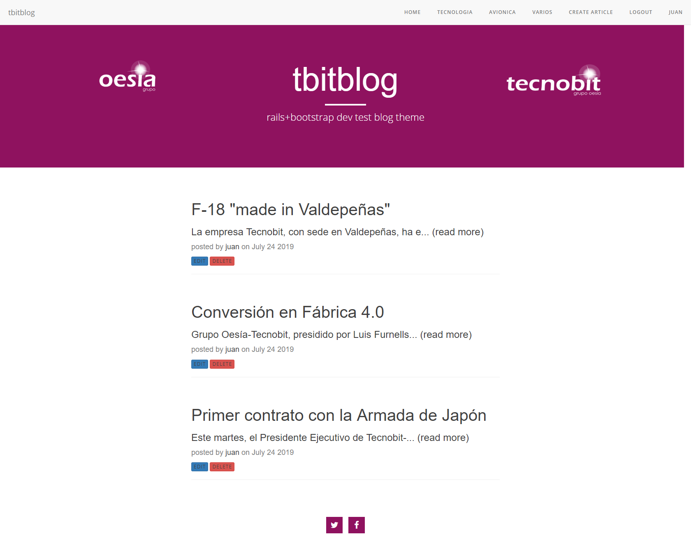
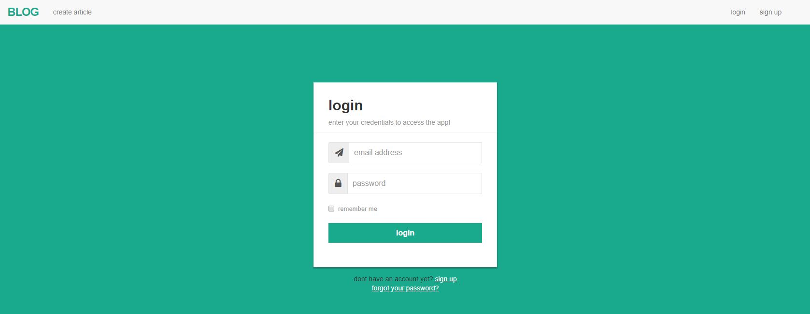

# rails-blog
  
simple blog in rails+bootstrap+devise authentication  
some screenshots with an adapted template
blog index  
  
example posts with comments  
 
some first version design screenshots  
singup  
 
login  
  
reset password
  
